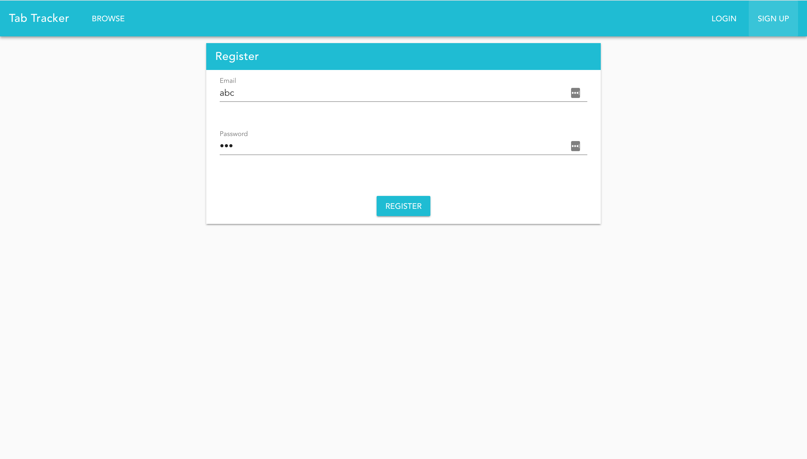
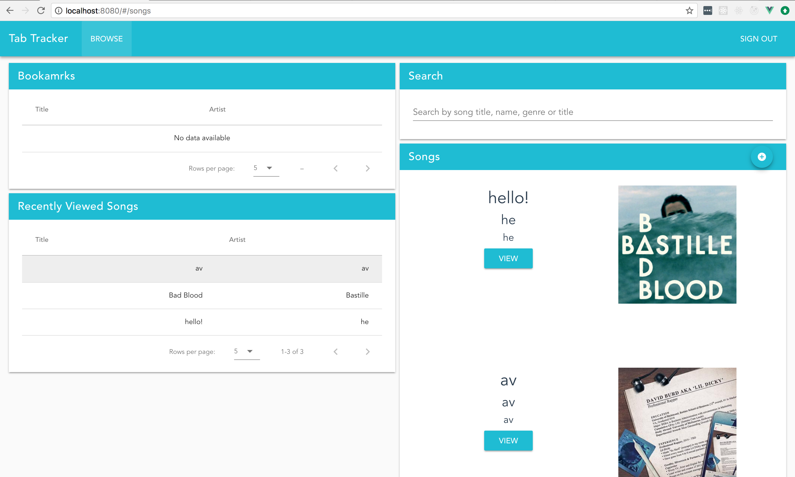
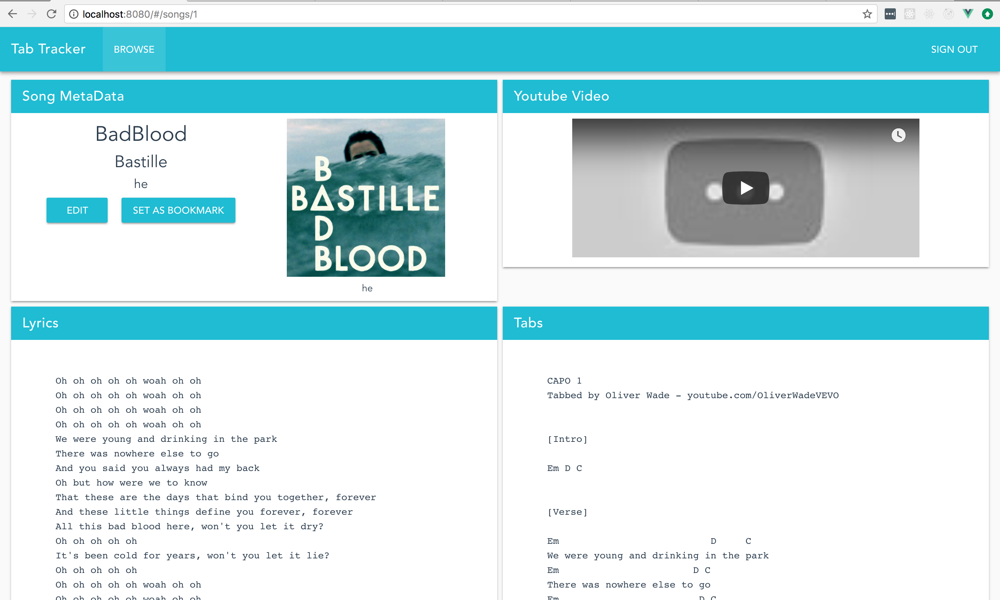
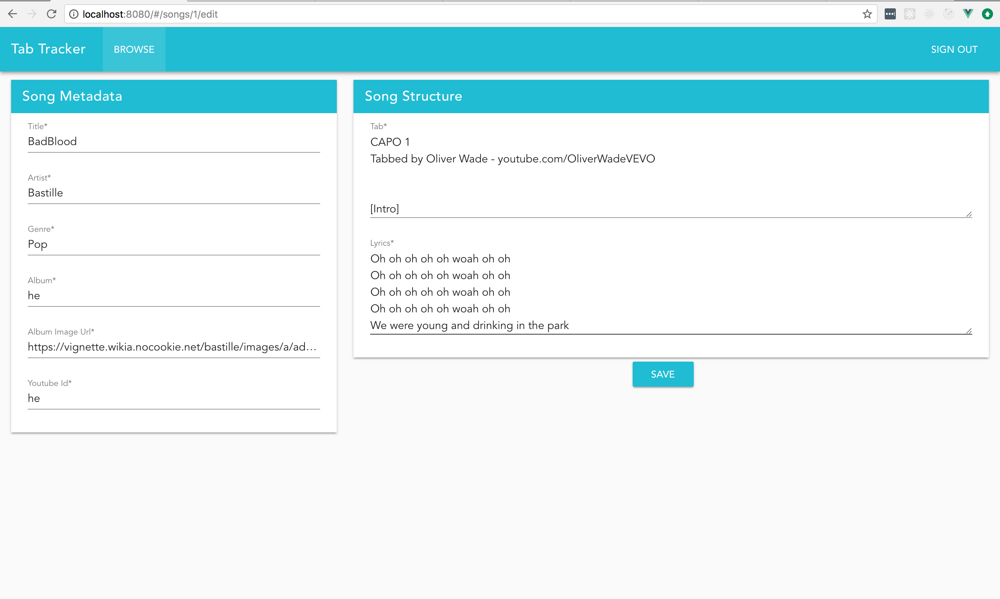

<!-- prettier-ignore -->
TabTracker is web app that:  
    Front End:  
    * vue2 to create components and manage those components to create multiple web pages  
    * vue-router to change from one the view of the app from one web page to another  
    * vuetify to create a more user-friendly user interface  
    * vuex to manage the state of the entire application  
    * vuex-persisted-state to ensure that application state does not reset upon the refresh of a web-page  
    * uses Google Material Design icons to create a more professional looking user-interface 
    
    Back End:  
    * uses sqlite3 database  
    * uses sequelize as an object-relational-mapping tool to have the databse understand JSON objects  
    * uses passport to embed the user into server calls instead of having the call pass in user information itself 
    to increase security  
    * uses json web token to create a token when a user is signed in, to further secure connection 
    * uses Joi to validate user input when signing up from an account 
    * uses express.js to create a server application 
    * uses bcrypt-js to hash a password once its entered upon user registration 
    * uses axios to create an HTTP web client 

Login Page View:

 

Home Page View:

 

View Song View:

 

Edit Song View:

